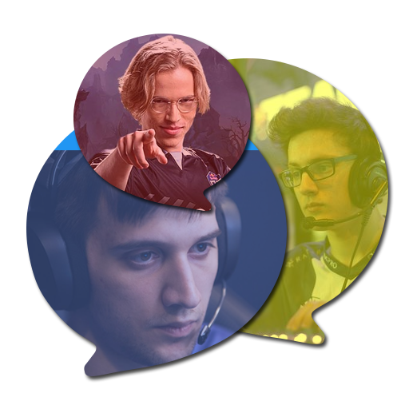

<p align="center">
  
</p>
<h1 align="center"> DotA Notifier </h1>

---

- [What is Dota Notifier?](#what-is-dota-notifier)
- [Features](#features)
- [Screenshots](#screenshots)
- [Usage and Installation](#usage-and-installation)

---


## What is Dota Notifier?

DotA Notifier is an app allows users following DotA2 Pro Players. 

You will never miss any live matches of your favorite Pro Players with this app.

## Features

- [x] Search Pro Player by name
- [x] Follow Pro Players you like, the app will notify you when your followed Pro Players go Live on DotaTV
- [x] Save the list of your followed Pro Players on your account, you can get notified on others devices after login without re-follow them again.
- [ ] Show top followed Pro Players
- [ ] Show current live match on DotaTV

## Screenshots

|| ||
|---|---|---|

|| ||
|---|---|---|

## Usage and Installation

There are two ways to use DotA Notifier:

### Published app available on playstore
You can download the app on [Google Play Store](https://play.google.com/store/apps/details?id=com.herokuapp.dotanotifier)

### Build your own version
1. Clone this repository
```
$ git clone git@github.com:noitq/dota_notifier_moible_app.git
```
2. Install the dependencies
```
$ flutter packages get
```
3. Replace all the api endpoints with your api endpoints.
To build your own api server, please check out the server code: https://github.com/noitq/dota_notifier_server

4. Build apk bundle
```
$ flutter build appbundle
```
